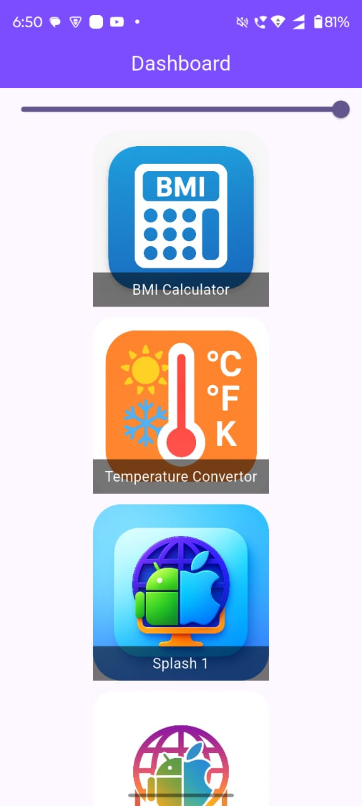
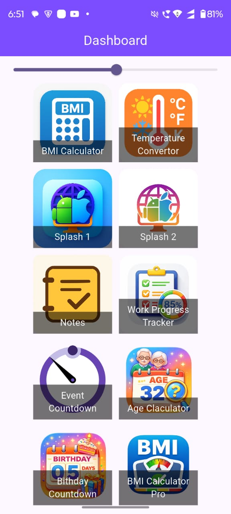
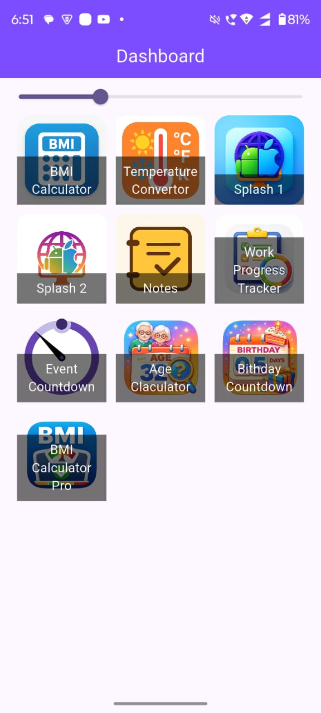
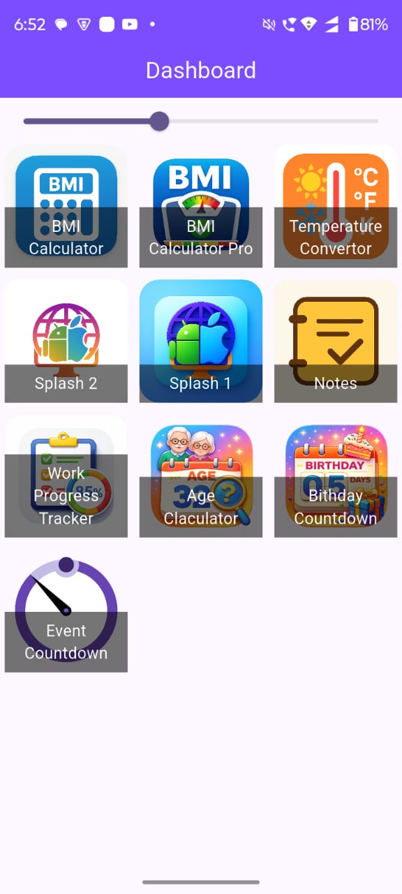
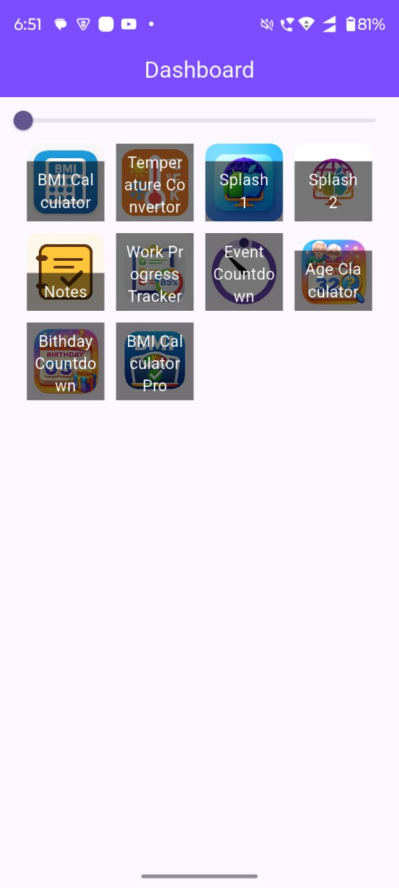

 India Soft Solutions Store

A digital store for showcasing and distributing software solutions, apps, and digital products built with modern technologies.

✨ Features

🛍️ Software & digital product listing

📦 Organized categories for easy browsing

📄 Detailed product descriptions

📱 Responsive design for all devices

⚡ Fast and lightweight performance

🔒 Secure and scalable architecture

📊 Fully Dynamic Dashboard

🔄 Users can rearrange dashboard items freely

🔍 Switch between large and small card sizes

📍 User-specific widget positioning

💾 Dashboard layout is saved in local memory

🔁 Restores the same arrangement on next app launch

📸 Screenshots

 
 
 
 
 
 

🚀 Quick Start
git clone your-repository-link
cd india_soft_solutions_store
flutter pub get
flutter run

🔧 Setup

Add required dependencies in pubspec.yaml:

dependencies:
flutter:
sdk: flutter

🛠️ Built With

Flutter

Dart

Material Design

📂 Project Structure
lib/
├── main.dart
├── pages/
└── models/

🎯 Use Cases

Showcase company software products

Distribute mobile & desktop applications

Present digital services & solutions

Client demos and portfolios

💾 Data & Preferences

User dashboard layout saved locally

Card size & position preferences persist across sessions

No data loss on app restart

📄 License

MIT License

⭐ Star this repository if you find it useful!